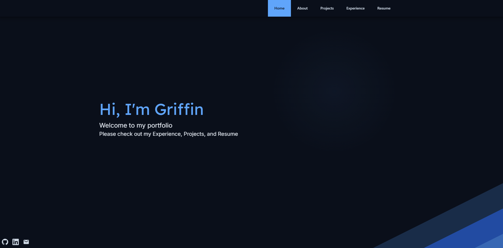
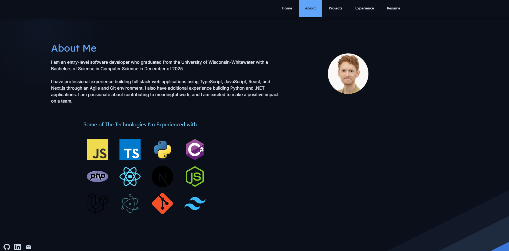

# Griffin Polly — Portfolio

A personal portfolio built with **Next.js** and **TypeScript**, showcasing my projects, experience, and resume.

**[Live Portfolio](https://portfolio-griffin-polly.vercel.app)**

## Preview
Home Page

About Page



## Tech Stack

- **Framework:** Next.js 16 / React 19
- **Language:** TypeScript
- **Styling:** Tailwind CSS 4
- **Analytics:** Vercel Analytics

---

## Getting Started

```bash
npm install
npm run dev
```

Open [http://localhost:3000](http://localhost:3000) in your browser.
